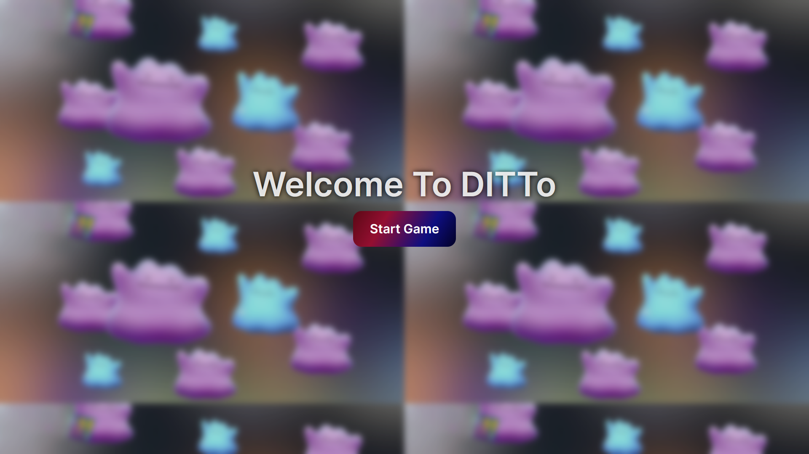

<div align="center">

# DITTO

### The Memory Card Game (pokemon Version)


 </div>

## Let's start 🏃

### ⬇️ Clone the repo

```bash
git clone https://github.com/nextpointer/unified-mentor-projects
```

### 🛠️ Install Dependencies

```bash
cd Ditto
bun install
```

### 🎮Lets play The Game🕹️

```bash
bun dev
```

then open [http://localhost:5173](http://localhost:5173) in your browser.

## 📸 Screenshots

   
   
   
