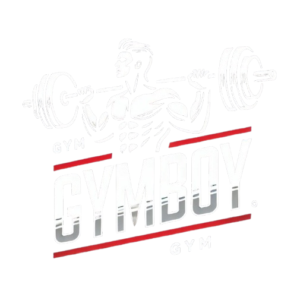

  

<h1> GymBoy :  GYM Management System 
🐧
</h1>

## Project Overview

The GYM Management System is a web-based application designed to help gym owners and members manage gym-related activities efficiently. This application eliminates the need for paper receipts and manual management of gym operations. It enables gym owners to generate and track bills, send notifications, and manage gym members digitally. Gym members can view their bills, receive notifications, and search for records. In the future, the system can be expanded to include features like a supplement store, nutrition advice, and personal training.

---

## Technologies Used

- **Frontend**: Vue.js, TypeScript
- **Backend**: Bun, Hono
- **Database**: Supabase
- **Build Tool**: Bun

#

  
