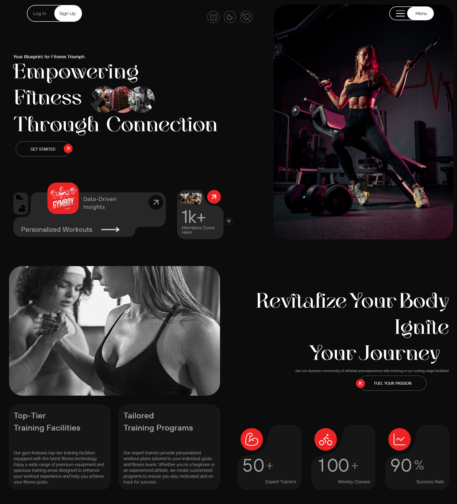
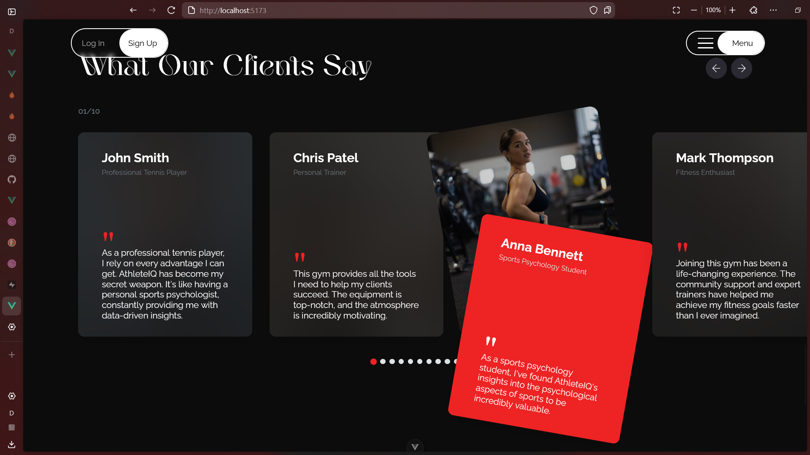
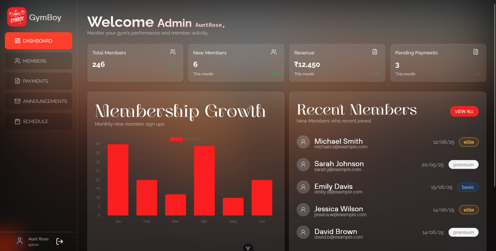
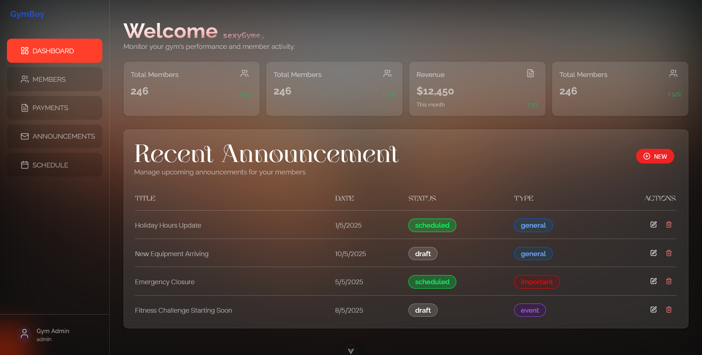
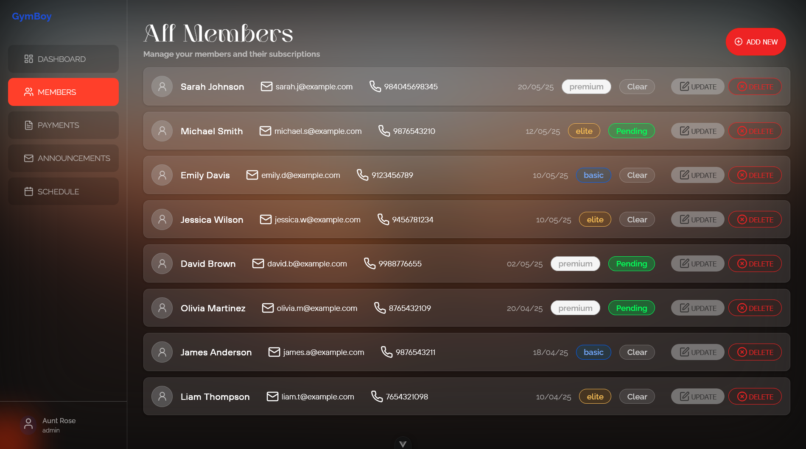
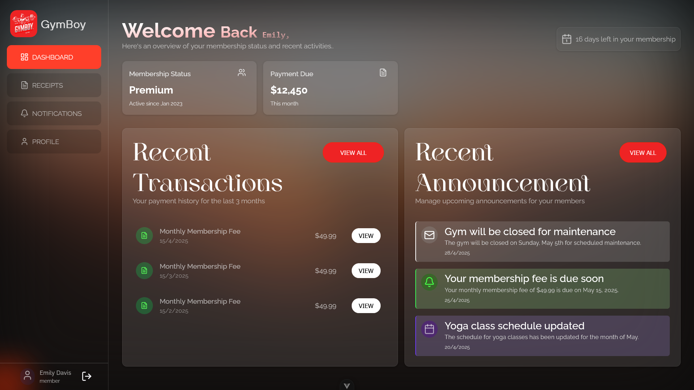
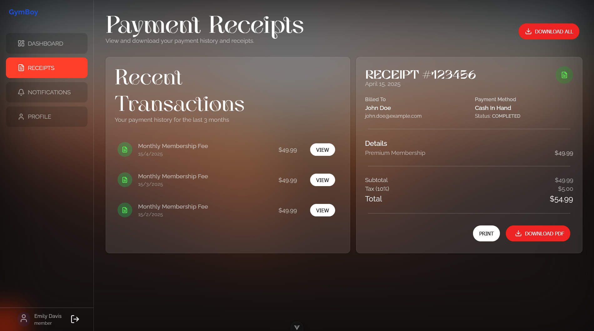

# Gymboy : frontend

This template should help get you started developing with Vue 3 in Vite.

## Project Setup

```bash
pnpm install
```

### Compile and Hot-Reload for Development

```sh
pnpm dev
```

### Type-Check, Compile and Minify for Production

```sh
pnpm build
```

### Lint with [ESLint](https://eslint.org/)

```sh
pnpm lint
```

## Landing Page

  

#

  

---

## Admin Dashboard

  

<br/>
  

<br/>

  

---

## Gym Member's Dashboard

  

  
